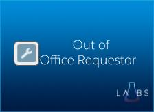
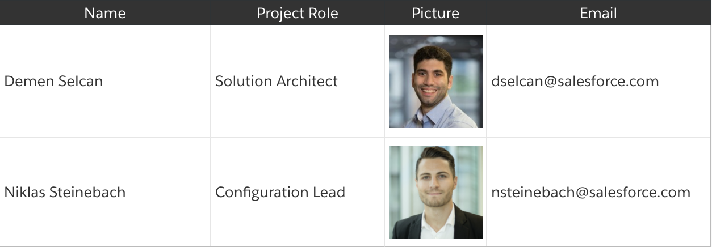
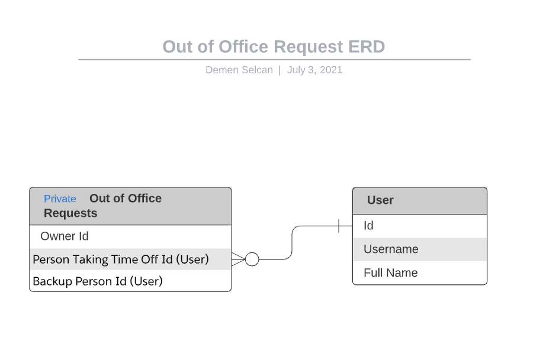

# SF Labs - Out of Office Requestor



We all love Time off don’t we? What we do not like though, is when you get back to the office, realize that work has piled up and your inbox is exploding. All of that, because you didn’t have the option to assign your work items to a backup in Salesforce!

Wouldn’t it be great if you can actually focus on your time off without having to worry if action item in Salesforce aren’t stuck?

Good news! This App provides you the option to assign a Backup who will get all your tasks, cases or any other relevant records while your are Out of the Office. Best of all, this App is completely free of charge, so you can simply install it and go. Enjoy!

## Team



### General Documentation

[General Documentation](https://salesforce.quip.com/p1GNA9b0kKq2 "General Documentation")

### Admin Guide

[Admin Guide](https://salesforce.quip.com/md4PAtZ0MlTu#IUFABA33ebN "Admin Guide")

### End User Guide

[End User Guide](https://salesforce.quip.com/OBK0ArZQyhWP#KQJABAtsm4B "End User Guide")

### ERD



### FAQs

[Frequently Asked Questions](https://salesforce.quip.com/2Jh5AUTbttuV#LKKABAZqAbu "FAQs")

### Installing this package

This package can be install via following links

**_Production Orgs:_** https://login.salesforce.com/packaging/installPackage.apexp?p0=04t4x000000AIkdAAG

**_Sandbox Orgs:_** https://test.salesforce.com/packaging/installPackage.apexp?p0=04t4x000000AIkdAAG

### Installing it via SFDX

```shell
sfdx force:package:install --package "04t4x000000AIkdAAG" --wait 10 --publishwait 10
```
